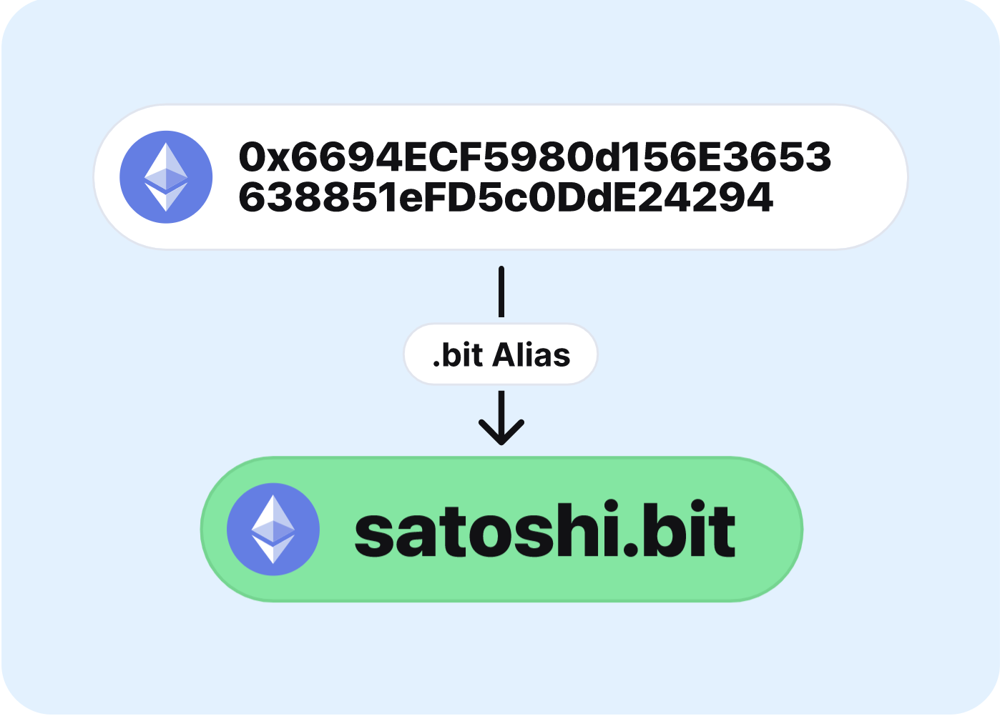
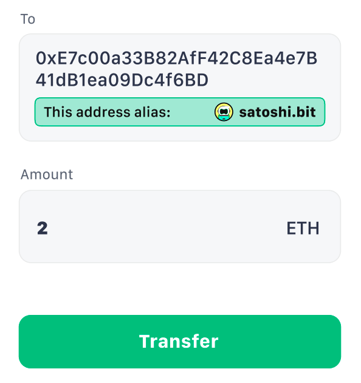

# .bit Alias

## Background
In the Web3 world, we often need to use various addresses such as Bitcoin addresses, Ethereum addresses, personal addresses, friend addresses, company addresses, etc. These addresses are often very long and difficult to distinguish. In different scenarios, we often encounter similar problems: who does this address belong to? Is it correct? Is it valid? These issues exist in scenarios such as transfers, blockchain explorers, personal pages, and game leaderboards.

We can't help but think: wouldn't it be great if we could convert these addresses into human-readable names?

Based on this idea, we have launched the .bit Alias feature.

## What is .bit Alias?
.bit Alias is the ability to map a blockchain address to a .bit account. With this feature, you can set a unique alias for any blockchain address.

For example, you can set an alias for your ETH address `0x1D6...485f` as `myeth.bit`. This way, when other developers display the address, they can also display the alias `myeth.bit`, making it easier for other users to see the owner of the address.

> .bit Alias is sometimes also called Reverse Resolution, because its original idea comes from DNS Reverse DNS lookup. That is, query the domain name corresponding to an IP address.

#### The difference between .bit Alias and .bit Lookup
Both involve "replacing addresses," what is the difference between .bit Lookup and .bit Alias?

**The core difference lies in the input and output.**

For .bit Lookup, we see a .bit account and want to know which blockchain address it corresponds to, i.e., `satoshi.bit` => `0xabc...def`.

For .bit Alias, we see a blockchain address and want to know which .bit account it belongs to, i.e., `0x123...456` => `satoshi.bit`.

**This leads to different usage scenarios.**

For .bit Lookup, it is more used in scenarios that directly involve **names**, such as personal pages and social platforms.

For .bit Alias, it is more used in scenarios where addresses are entered during transfers to improve transfer security; and in Dapps to replace addresses with names, improving the user experience.

## Use cases
There are many use cases for .bit Alias, here is a typical example:

### Two-factor authentication during transfers
In the blockchain world, tragedies often occur due to incorrect transfer addresses resulting in the loss of a large amount of assets. Here is a common example:

When using a wallet to make multiple transfers, we copy different addresses multiple times and then transfer the corresponding tokens.

For example, the first transfer is 100 USDT to external partner `0x123...456`. The second transfer is 100 ETH to the address of our colleague Satoshi, `0xabc...def`.

However, if the second copy fails, we will paste the result of the last copy into the input box. At this point, we are not aware that we are sending funds to the wrong address! Because addresses are difficult to distinguish with the naked eye, we also cannot get reasonable prompts. The result is that we end up transferring 100 ETH to the partner `0x123...456`!

At this point, if the recipient is not a decent person, our assets will be at risk of being lost!

However, if at this point we could see that the recipient is `satoshi.bit`, I believe this tragedy would not happen.

For particularly large asset sending behaviors, wallets/exchanges can even display only partial characters of the alias, and the sender needs to complete it to send the asset. This two-step confirmation mechanism improves the user's sense of security when sending assets and actually enhances the security of the asset sending operation.

Behind this is the use of the .bit alias function to prompt the wallet which .bit the current interaction address belongs to. This can greatly improve the security of transfers.

## Two-Factor Authentication
To enable .bit aliases, users need to perform two operations:
1. Add the address they want to set the alias to to their .bit data container or ensure that the `owner` or `manager` address of their .bit account is their address.
2. Open the [.bit alias setting](https://app.did.id/alias) page, log in to the address you want to set the alias for, and set it to one of your .bit accounts.

When developers verify, they need to follow these two steps:
1. Based on the address provided by the user, call the .bit alias interface to obtain the corresponding .bit alias.
2. Use the obtained .bit alias to call the .bit resolution interface to obtain the corresponding .bit account information and resolution record, and see if the `owner` and `manager` of the account and the provided address exist in the resolution record. If it exists, it is determined that the alias of the address corresponds to the .bit account; otherwise, it is considered that the address does not have a valid alias.

#### Why Two-Factor Authentication?
You may wonder, why do users need to set it up in two steps, and developers need to query in two steps?

This is because if we only do a simple .bit alias query, that is, `0x123...456` => `satoshi.bit`, potential attackers may set the alias of their address to someone else's .bit account.

For example, your address is `0xabc...def`, and your .bit account is `satoshi.bit`, and the attacker's address is `0x123...456`. The attacker then sets the alias of their address to your account `satoshi.bit`. If we only do a simple .bit alias query, then other users in the relevant application will see that the attacker's address is displayed as your name `satoshi.bit`. Then your friend might think, "Oh, this is Satoshi's address, let me send him some money." However, in reality, he sends the money to the attacker's address.

To avoid this behavior, we require two steps, that is, after setting up the .bit alias, to make the alias effective, it is also necessary to ensure that the corresponding address is in the resolution record of the .bit data container (or the address is the `owner` or `manager` of the account).

This ensures that the alias you set is definitely set by you, not someone else.

## Any Address

Although ENS and other applications provide similar capabilities (called Primary Record), which can map Ethereum addresses to an ENS domain name, ENS only supports applications based on Ethereum addresses. When using other blockchains such as BNB, Tron, or Dogecoin, this feature is not available. Moreover, due to the limitations of ENS contracts, ENS only allows mapping one Ethereum address to one ENS domain name, and it is impossible to map multiple addresses to the same ENS domain name.

However, the .bit alias is different. With the open cryptographic technology of .bit, any blockchain address can have a .bit alias. Therefore, you can set a .bit alias for any blockchain address. For example, you can set an alias for your Ethereum address or your Tron address. You can even set an alias for Bitcoin or Dogecoin.

This is very useful in practical scenarios.

In fact, due to the strong compatibility and scalability of .bit aliases, they can be applied to any public-private key pair, just like any public-private key can have and manage a .bit account. This also means that .bit aliases can not only bring us a safer and friendlier experience in the blockchain, but also play a role in other Web3 scenarios that we have not yet imagined. Imagine one day in the future, you can set an alias for your SSH public key or your OpenPGP public key. Then, when your friends and colleagues see your public key, they can immediately know that this is your account without worrying about getting the wrong account.

## Completely Free

In the previous version of .bit aliases, we charged a storage fee of 201 CKB for each alias. We believe that this hindered the application and promotion of .bit aliases, and thus, hindered the improvement of the security of the entire Web3 world.

Therefore, we have launched a brand new .bit alias! From now on, you can set aliases for any address without paying any fees!

> [Set now](https://app.did.id/alias)

## Developer Guide

If developers need to resolve .bit aliases, they only need to use the corresponding SDK or API.

- JS SDK: [dotbit.js](https://github.com/dotbitHQ/dotbit.js/blob/main/docs/api/dotbit.md#alias)
- HTTP API: [das-account-indexer](https://github.com/dotbitHQ/das-account-indexer/blob/main/API.md#get-reverse-record-info)

> If you use the API directly, please remember to call the records interface for verification after calling the .bit alias interface. For details, please see: [Two-step verification](#two-step-verification)

## Outlook

.bit is the only DID name system in the industry that can provide alias services for all blockchain addresses. We expect this feature to provide better user experience and higher security for the entire industry.

In the future, we will support alias services for more public chains. If you have any questions or want to support us, please feel free to contact us.

Let's work together to make a greater contribution to the security of Web3!

## FAQ

### Can one address have multiple .bit aliases?

No, one address can only have one .bit alias. If multiple aliases are allowed for one address, it will cause confusion for users and applications when displaying the corresponding alias.

### Will my .bit alias be invalid if my .bit account expires?

Yes, your .bit alias will be invalid.

When your account expires, although the .bit alias data on the blockchain will be retained, the records resolved by your .bit alias will be cleared. As a valid .bit alias requires [two-step verification](#two-step-verification), the second step of the .bit resolution process will fail, ultimately causing your .bit alias to be invalid.

When you renew or re-register your expired .bit account, your .bit alias will be valid again.

### Will my .bit alias be invalid if my .bit account is sold or transferred to someone else?

Yes, your .bit alias will be invalid.

When you transfer your .bit account, although the .bit alias data on the blockchain will be retained, the records resolved by the original account's .bit alias will be cleared. As a valid .bit alias requires [two-step verification](#two-step-verification), the second step of the .bit resolution process will fail, ultimately causing your .bit alias to be invalid.

When you regain ownership of the original .bit account, your .bit alias will be valid again.

### Can I set my .bit alias for someone else's .bit account?

Yes, you can. As long as your address is the Manager of that .bit account or is stored in the data of that account, your .bit alias will be valid.

### Can I set the .bit aliases of multiple addresses to the same .bit account?

Yes, you can. As long as the .bit aliases of these addresses meet either of the following conditions, they will be valid:

- Your address is the Owner/Manager of that .bit account;
- Your address is stored in the data of that .bit account.

### Why is my .bit alias not valid?

If your .bit alias is invalid, please check the following reasons one by one:

1. The .bit account has been sold, and you are not the Owner/Manager of that .bit account;
2. The data of the .bit account has been modified, and your address is not stored in the data of that .bit account;
3. The Owner permission of the .bit account has been transferred, and the stored data has been cleared, and your address is not stored in the data of that .bit account.
4. The .bit account has been converted to an NFT on Ethereum. You can convert it back to a regular .bit account and reset it. [Convert .bit to Ethereum NFT](./eth-nft.md)

### Which applications have integrated .bit aliases?

Currently, .bit DApp, DIDTop, NFTScan, NFTGo, WePiggy, ShowMe, and others have supported .bit aliases. [See more](https://www.did.id/ecosystems).
