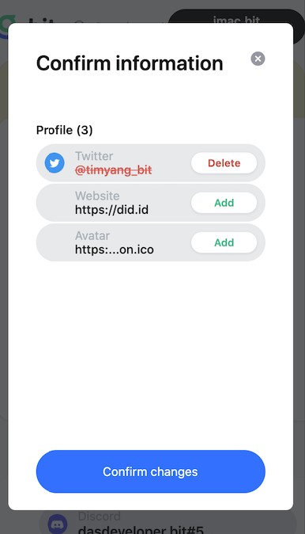

# data.did.id
以一种前所未有的优雅方式管理您的所有 .bit 数据。

## 介绍
[data.did.id](https://data.did.id/dasdeveloper.bit) 是一个优雅的 .bit 账户数据管理工具。

在这里，你可以**查看**任意一个 .bit 账户的数据，包括且不限于以下数据：
- 个人资料（profile）
- 数字货币地址（address）
- 去中心化网站（dweb）
- 自定义数据（custom）
- 权限（owner/manager）
- ...

如果您是某个账户的**管理员或者拥有者**，您还可以管理这些数据或者更改该账户的权限。

如果您是**开发者**，您甚至可以让用户[通过 URL 改变 .bit 数据](#通过-url-改变-bit-数据)

> 一句话，涉及对于账户数据的管理，来这里就对了。

## 通过 URL 改变 .bit 数据

每天，都有很多开发者在探索如何开发和 .bit 结合的有趣应用。

在这个快速变化的区块链时代，最重要的是快速验证业务的可行性，而不是把时间花在对基础设施的研究上。

通过 [data.did.id](https://data.did.id/dasdeveloper.bit) ，开发者可以以一种非常简单、优雅的方式去改变用户的数据，而不用考虑复杂的链上操作。

> [点击这里体验一下 →](https://data.did.id/dasdeveloper.bit?records=%5B%7B%22action%22%3A%22add%22,%22key%22%3A%22profile.website%22,%22value%22%3A%22https%3A%2F%2Fdid.id%22%7D,%7B%22action%22%3A%22delete%22,%22key%22%3A%22profile.twitter%22%7D,%7B%22action%22%3A%22replace%22,%22key%22%3A%22profile.avatar%22,%22value%22%3A%22https%3A%2F%2Fdata.did.id%2Ffavicon.ico%22%7D%5D)

### 快速开始

[data.did.id](https://data.did.id/dasdeveloper.bit) 会读取 URL 上的 `records` 参数。

开发者只需要根据规范来填入特定的参数，并引导用户访问相应的链接，待用户确定后即可完成对用户数据的更改。

其大致流程如下：
```javascript
const records = [{
  action: 'add',
  key: 'profile.website',
  value: 'https://did.id',
}, {
  action: 'delete',
  key: 'profile.twitter',
}, {
  action: 'replace',
  key: 'profile.avatar',
  value: 'https://data.did.id/favicon.ico',
}]

const queryString = window.encodeURIComponent(JSON.stringify(records))

window.open(`https://data.did.id/dasdeveloper.bit?records=${queryString}`)
```
用户打开相应的链接之后，将会看到类似如下界面：


当用户点击确认后，将会完成数据的更新操作。

这个过程中，开发者完全不用考虑相对复杂的链上操作，同时完全不会损坏用户数据的安全性。

### 参数：`records`
`records` 参数是一个数组，其内容的每一项都是一个针对当前 .bit 账户的操作（action），包括如下操作：
- 新增（add）
- 删除（delete）
- 替换（replace）

> 注意，`records`参数的值，必须是一个有效的 JSON 字符串，并且经过 `encodeURIComponent` 转义。

根据操作的不同，则会有不同的参数要求，要求见下：

#### 增加数据: add
这将增加对应的 .bit 数据。

> 如果已有相同的 key，则之前的 key 不会被覆盖，新旧数据都会同时存在。

```javascript
const records = [{
  action: 'add',
  key: 'profile.twitter',
  value: 'dotbit',
  label: 'dotbitHQ',
  ttl: 300,
}, {
  action: 'add',
  key: 'profile.website',
  value: 'https://did.id',
}]
```

#### 删除数据: delete
这将删除对应的 .bit 数据。

> 如果有多个相同的 key，则将删除该相同 key 下所有的数据。

```javascript
const records = [{
  action: 'delete',
  key: 'profile.twitter',
}, {
  action: 'delete',
  key: 'profile.website',
}]
```

#### 修改数据: replace
这将替换对应的 .bit 数据。

> 由于 .bit 允许存在多个相同的 key，所以无法通过 URL 参数指定要修改哪个 key 的参数。
> 
> 所以如果要修改 key，则通过完全替换的方式来完成"修改"操作。
> 
> 这里是用新的 key 完全替换之前所有的 key，如果之前有多个相同的 key，则他们都会被新的数据给覆盖。

```javascript
const records = [{
  action: 'replace',
  key: 'profile.avatar',
  value: 'https://data.did.id/favicon.ico',
}]
```

因此，如果要修改某个 key 的数据，则需要通过使用 replace 操作来完成。

### 注意
鉴于多个操作（action）的语义二义性，我们不建议针对一个 key 使用多个不同的 `action`，不然可能会造成和预期不一样的结果。