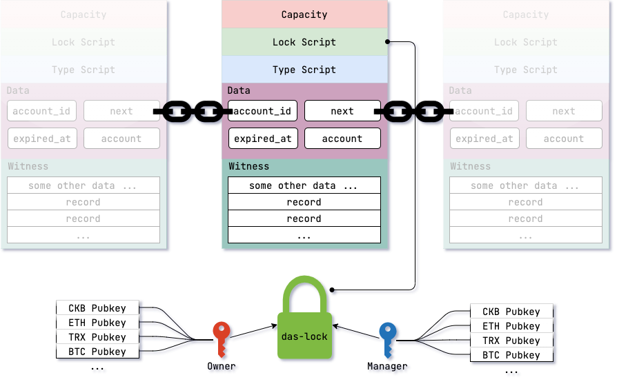

# 账户注册流程

不同于以太坊公链使用的账户模型，.bit 依赖的 Nervos 公链使用 UTXO（Cell）模型，其特点是链下确定性。

不同的编程模型也带来了不同的开发体验。这里以注册流程为例，来说明下 .bit 独特的注册流程。

1. 用户首先通过钱包中的浏览器访问 .bit 的注册服务（如：[app.did.id](https://app.did.id)）；
2. 注册服务(Registrar)可以是由任何人实现的为用户提供 .bit 注册功能的服务，包括 Web 端，移动端，客户端等等。
3. 注册服务将用户的注册请求以及其他各种操作转换成交易，通过钱包让用户签名后上链；
4. 守护服务(Keeper)是去中心化的 .bit 节点，随时通过节点 RPC 监控链上交易；
5. 当 Keeper 发现链上有需要处理的用户交易时，就按照交易结构协议创建特定的交易完成诸如账户注册等工作；
6. 如果注册服务做的比较完善，可以通过节点的 RPC 监控用户的账户注册等状态，并在成功后及时的反馈给用户；
7. 当用户注册成功账户，并设置解析记录后，解析服务(Resolver)就可以通过节点 RPC 解析链上区块获取数据；
8. 最后，解析服务通过自己的 RPC 接口将数据提供给钱包、交易所等需要使用解析记录的应用完成对用户账户的利用。

## 账户唯一性和注册流程
经过上面的账户注册流程之后，就创建了 .bit 中最核心的一项资产，即 .bit 账户。其核心价值所在就是唯一性，而理解 .bit 账户唯一性的关键就在于理解 .bit 账户的注册流程，所以这里对注册流程做一个简单的概览，如下图所示：

1. 首先用户需要申请注册，这一步用户的账户名是被 hash 的保密状态，即只有用户知道其账户及其 hash。其他用户只能在链上看到无法还原的账户 hash。
2. 等待一段时间后用户可以发起预注册交易，提供需要账户名的明文以及注册费；
3. 如果守护服务在链上发现了预注册交易，它就检查账户名的唯一性并创建一个携带唯一性证明的提案，并广播一笔基于这个提案生成的交易；
4. 最后等待一段时间后，守护服务就可以确认提案，完成新账户的注册，这里的设计及其原理详见账户链机制；

## 链上账户结构
当账户注册成功后账户信息就会通过一个 Cell（称之为 AccountCell）保存在链上，而这一个个的 Cell 最终可以构成一个单向有序链表，也就是账户注册流程中唯一性的证明：

## 账号管理
注册完 .bit 账号之后，就可以进行账户的管理了。当处于不同的状态时，.bit 账号有不同的功能可以操作，详见以下文档：
- [.bit 账号状态和生命周期](./lifecycle.md)
- [.bit 权限设计](./permissions.md)

## FAQ

### 可以使用哪些公链地址注册 .bit 账户？

目前支持使用 ETH / TRX / Dogecoin / BSC / Polygon 地址注册 .bit 账户。

访问 [did.id](https://app.did.id)之后，连接 MetaMask 或者 TronLink 钱包即可开始注册。也可在支持 ETH / TRX /Dogecoin / BSC / Polygon 的钱包 APP 中直接访问 [app.did.id](https://did.id) 进行注册。

技术上，.bit 可以使用任意公链地址进行注册（[查看原理](../others/why-assets-on-ckb-can-be-managed-by-btc-address.md)）。.bit 团队正在将更多公链的签名算法部署到 Nervos CKB 上，以支持更多公链地址注册 .bit。

### 为什么可以用不同公链地址注册 .bit 账户？是中心化的方案吗？

这是 .bit 超越其他去中心化域名/账户系统的独特之处。事实上，不光可以使用所有公链地址注册 .bit 账户，你甚至可以使用普通的邮箱来注册/持有/管理 .bit 账户。并且，技术上是完全去中心化的，不需要信任任何中心化组织。

这得益于 .bit 所依赖的 Nervos CKB 公链，相关的技术细节可以参考[BTC 地址如何管理 CKB 链上的资产](../others/why-assets-on-ckb-can-be-managed-by-btc-address.md)

### 为什么 .bit 账户要按年收费，为什么不能一次购买永久使用呢？

一次性购买永久行使用，并不是一个合理的经济模型。这种模型存在的问题包括：

1. 当优质的账户被购买殆尽之后，.bit 系统将不再有收入产生，现有开发团队便缺乏了持续改进系统的动力，也无法吸引新的开发者来维护 .bit。然而作为基础设施，.bit 的持续改进和推广，将是不可避免的。因此，一次购买永久使用看似很有吸引力，但用户购买到的其实是一个未来不会有人维护的账户。
2. 私钥丢失等会导致 .bit 账户永久性锁死。这对于 .bit 账户这种有限的公共资源而言，是一种浪费。

事实上，你也可以一次性为 .bit 账户续费数十年，以实现“永久使用“。

### 什么是存储押金？

每个 .bit 账户的数据都存储在区块链上，存储数据需要存储空间，而存储空间需要质押代币才可使用。当账户过期回收时，相应的存储空间被释放，质押的代币会归还给当时的账户所有人。

同时，.bit 通过良好的设计，实现了：在注册时一次性支付存储押金，使用过程中无论添加多少解析记录，都不需要补充押金。

另外，由于 .bit 智能合约运行在 Nervos CKB 上，存储押金将以 CKB 的形式退还。

### 为什么注册时提示“无效的字符组合”？

为防止欺诈，.bit 做了一些限制，即某些字符集不能同时出现在账户名当中。详细规则，请参考：[字符集](../register-das/charsets.md)

### 可以注册子账户吗？

可以！

子账户功能已上线，并在测试阶段。测试阶段开通子账户需要加入白名单。 如果你想加入白名单体验子账户功能，请发邮件申请：[melissa@did.id](melissa@did.id)。

开通后，可以在您的账户数据页进行子账户的发放 [data.did.id](https://data.did.id)。

> 更多内容，请查看：[.bit SubDID](./subdid.md)

### 什么是防抢注？防抢注的原理是什么？

在区块链上，用户的所有操作都是公开透明的。因此，当一个用户想要注册某个 .bit 账户，对应的交易还在内存池中没有被打包进区块时，其他人是可以看到该用户想要注册什么账户的。其他人可以立即发出一笔网络手续费更高的交易，企图让矿工优先打包这个交易，来抢注这个账户。然后再高价将这个账户卖给真正想注册它的人。

防抢注，便是要尽可能防止上述这种行为得逞。

.bit 合约要求注册新的账户必须经过两个步骤，对应两笔交易，以此来完美防止上述抢注行为。

1. **私密发起注册申请**：将要注册的账户与注册人的公钥进行一次 Hash，发送第一笔交易，将这个 Hash 放到区块链上
2. **链上公开账户名**：真正的发起注册请求，公开要注册的账户名，并携带上一步中的 Hash。同时合约要求 Hash 达到成熟状态，即上一笔交易已经被打包进入区块并达到了一定的确认数。

两笔交易需要一定的间隔，第二笔交易需要引入第一笔交易创造的 Cell。并且，用户在第二步中才会公开自己要注册的账户的明文。当恶意 Keeper 或者矿工看到明文时，其实已经来不及了。他必须先从第一笔交易开始，等他准备好的时候，其他 Keeper 已经帮用户完成注册了。

### 为什么界面显示已经完成抢注步骤，还是被别人抢注了？

这种情况唯一的可能是，别人和你恰好都想注册这个账户，而且都在差不多的时间进行了注册。防抢注只能防止别人通过观察区块链获取到你想要注册的账户之后的恶意抢注。但无法防止各方刚好都在同一时间自发地去注册某个账户。

### 注册失败支付的费用会退还吗？

会退还。退还的方式和时间取决于你所使用的注册商。

### 如何才能获取被保留账户？

每个保留账户都有其被保留的原因，他们往往被判定为归属于某个组织或者个人。可以在 Github 上看到每个账户被保留的原因。被保留的账户只能被其对应的组织或者个人所申领。[如何认领保留账户](https://dasystems.medium.com/claim-your-das-name-for-your-brand-ac487df02d5c)

### 注册商是 .bit 团队吗，不同注册商有什么区别？

注册商不是 .bit 团队。事实上，任何人都可以成为注册商，毕竟任何人都可以直接和 .bit 的智能合约交互。

不同注册商提供的用户界面和支付方式有所不同。